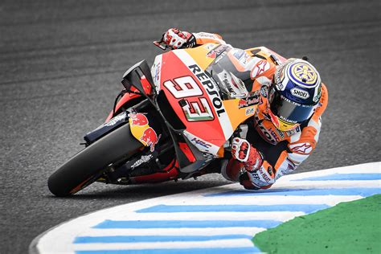

# motogp-dl



A Python script for downloading MotoGP videos from Reddit's r/MotorsportsReplays subreddit. The script checks for new posts every hour and downloads any new videos that are posted.

It also has the ability to check for free disk space and delete old videos if the disk is full. This feature can be disabled by setting the `DELETE_OLD_FILES` variable to `True`.

## Setup

To use this script, you need to follow these steps:

1. Build the Docker image by running the following command in your terminal:

```bash
docker build -t motogp-dl .
```

This will create a Docker image with all the necessary dependencies installed.

2. Deploy the Docker container by running the following command:

```bash
sh scripts/container.sh
```

This will start the container and run the Python script.

## Configuration

The script can be configured by changing the values of the following variables in the `config.yaml` file. Some of these can also be set as environment variables in the `config.env` file, for added security.
```
FEED - The URL of the RSS feed to check for new posts
DOWNLOAD_TYPES - example: ["motogp", "formula 1"]. The script will only download videos that match one of these keywords in post titles.
DOWNLOAD_DIR - The directory where the videos will be downloaded to.
QUALITY - ex. "1080" or "720". The script will only download videos that match this quality in the title.
INTERVAL_MINS - Interval in minutes between each check for new posts. Integer value in mins.
DELETE_OLD_FILES - If set to True, the script will delete old videos if the disk is under threshold value described below.
DELETE_OLD_FILES_THRESHOLD - The minimum amount of free disk space in GB. If the disk is under this threshold, the script will delete old videos. Integer value in GB.
GOTIFY_URL - The URL of your Gotify server
GOTIFY_APP_ID - The ID of your Gotify application
GOTIFY_TOKEN - The token of your Gotify application
TELEGRAM_TOKEN - The token of your Telegram bot
TELEGRAM_CHAT_ID - The chat ID of your Telegram bot
```

## Notifications (Optional)
If you want to receive notifications when the script downloads a new video, you can use the Gotify or Telegram 
notification service. To do this, you need to follow these steps:
1. Setup a Gotify server by following the instructions on the [Gotify website](https://gotify.net/docs/install).
2. Setup a Telegram bot by following the instructions on the [Telegram website](https://core.telegram.org/bots#6-botfather).
3. Create a new application on the Gotify server called "motogp-dl" and update the config.env file as shown -

```bash
GOTIFY_URL=http://192.168.1.200:7164  # The URL of your Gotify server
GOTIFY_APP_ID=motogp-dl # The ID of your Gotify application
GOTIFY_TOKEN=xxxxxxxxxxx # The token of your Gotify application
TELEGRAM_TOKEN=xxxxxxxxxxx # The token of your Telegram bot
TELEGRAM_CHAT_ID=xxxxxxxxxxx # The chat ID of your Telegram bot
```

You can disable notifications by setting the `NOTIFICATIONS_ENABLED` variable to `False` in the config.yaml file.

## Dependencies

This script requires the following dependencies:

- Python (version 3.10)
- Docker (version 23.0)

## Troubleshooting

If you encounter any issues while running this script, here are some troubleshooting steps you can try:

- Make sure you have installed all the dependencies listed in the `Dependencies` section above.
- If you are having issues building the Docker image, try running the command with sudo:

```bash
sudo docker build -t motogp-dl .
```

- If the container fails to start, try checking the Docker logs for any error messages:

```bash
docker logs -f motogp-dl
```

- If you are still having issues, feel free to open an issue on this repository or contact the developer for support.
