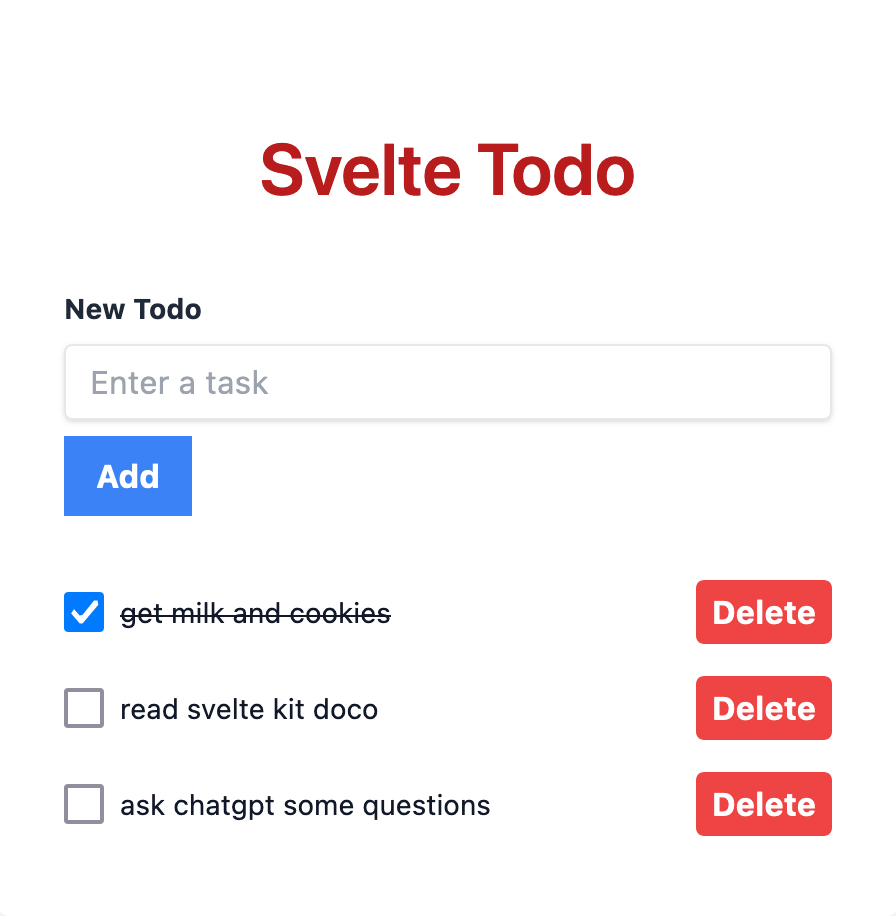

# Svelte Todo Application

This is a simple Todo application built using Svelte and Tailwind CSS.



## Prerequisites

Before you begin, ensure you have met the following requirements:

* You have installed node.js and npm.
* You are familiar with basic terminal commands.

## Installing Svelte Todo Application

To install Svelte Todo Application, follow these steps:

1. Clone this repository to your local machine:

```bash
git clone https://github.com/yourusername/svelte-todo.git
```

2. Install all the required packages:

```bash
cd svelte-todo
npm install
```

## Using Svelte Todo Application

To use Svelte Todo Application, follow these steps:

1. Start the development server:

```bash
npm run dev
```

2. Open your web browser and navigate to http://localhost:5000

## Features

This application allows you to:

* Add new todo items.
* Delete existing todo items.
* Mark todo items as done/undone.

## Contributing to Svelte Todo Application

To contribute to Svelte Todo Application, follow these steps:

1. Fork this repository.
2. Create a new branch: git checkout -b <branch_name>.
3. Make your changes and commit them: git commit -m '<commit_message>'
4. Push to the original branch: git push origin <project_name>/<location>
5. Create the pull request.
